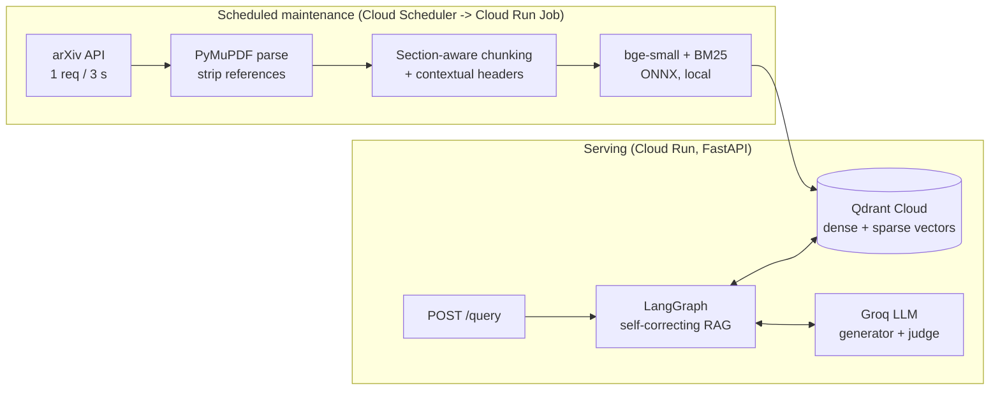
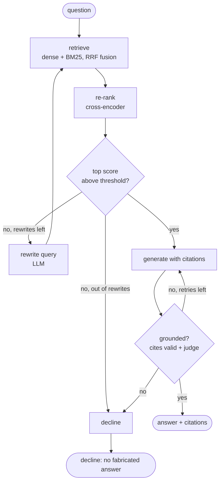

# Advanced RAG over arXiv

A research assistant that answers questions about recent ML/AI papers **with cited sources**, using
hybrid retrieval, cross-encoder re-ranking, and a self-correction loop that checks its own
groundedness before answering. An automated eval suite gates changes in CI, and a scheduled job
keeps the index current. Everything runs on free tiers.

> Not a notebook demo: retries and rate-limit handling on every external call, idempotent and
> crash-safe ingestion, a fail-closed groundedness check, a CI quality gate, and a scheduled
> maintenance job. Design decisions and their trade-offs are in [docs/tradeoffs.md](docs/tradeoffs.md).

## Architecture



### The query graph



- **Retrieval grading is free:** the cross-encoder score decides whether retrieval is good enough, so no LLM call is spent on it.
- **Groundedness is checked twice:** first in code (does the answer cite valid sources at all, no LLM call), then by an LLM judge using schema-constrained output.
- **It fails closed:** if the answer can't be verified, or the judge errors, the system declines instead of returning an unchecked answer.

## What makes it more than naive RAG

| Technique | Where |
|---|---|
| Hybrid retrieval (dense + BM25, reciprocal-rank fusion) in a single Qdrant query | [retrieval/retriever.py](src/advanced_rag/retrieval/retriever.py) |
| Cross-encoder re-ranking | same |
| Query rewriting on weak retrieval | [graph/](src/advanced_rag/graph) |
| Groundedness check, regenerate once, then decline | [graph/nodes.py](src/advanced_rag/graph/nodes.py) |
| Contextual chunk headers (title + section embedded with each chunk) | [ingestion/chunker.py](src/advanced_rag/ingestion/chunker.py) |
| Idempotent, crash-safe ingestion | [ingestion/pipeline.py](src/advanced_rag/ingestion/pipeline.py) |
| Automated eval with a CI gate | [eval/](src/advanced_rag/eval), [.github/workflows/eval.yml](.github/workflows/eval.yml) |
| Scheduled re-indexing with a retention policy | [jobs/reindex_job.py](jobs/reindex_job.py) |

## Quickstart

```bash
uv sync                      # Python 3.12
cp .env.example .env         # add GROQ_API_KEY; leave QDRANT_URL empty for embedded local mode
uv run python -m advanced_rag.ingestion --ids-file evals/pinned_papers.txt   # ~15 papers, 10-15 min on CPU
uv run python -m uvicorn advanced_rag.api.main:app --port 8000
curl -s localhost:8000/query -H 'content-type: application/json' \
  -d '{"question": "How does Self-RAG decide when to retrieve?", "debug": true}'
```

Endpoints: `POST /query` (rate-limited), `POST /ingest` (needs `X-API-Key`), `GET /health`, `GET /ready`.
The response includes citations (paper, section, link, snippet), whether the answer was grounded,
how many rewrites and LLM calls it took, and with `debug` a per-node trace.

```bash
uv run pytest                                          # 30+ tests, no network or API keys needed
uv run python -m advanced_rag.eval.retrieval_eval      # retrieval ablation, no LLM
uv run python -m advanced_rag.eval.ragas_eval --limit 8   # RAGAS (needs GROQ_API_KEY)
```

## Results

**Retrieval ablation** (paper-level, k=6, 26 answerable questions over 15 papers):

| mode | recall@k | MRR | nDCG |
|---|---|---|---|
| dense | 0.962 | 0.933 | 0.94 |
| hybrid | 1.0 | 0.981 | 0.983 |
| hybrid_rerank | 1.0 | 0.981 | 0.981 |

Hybrid beats dense-only. Re-ranking does not move paper-level metrics here because the corpus is
only 15 papers, so the metric is saturated; its value shows up on larger indexes. This is stated
rather than hidden.

EVAL_RESULTS_PLACEHOLDER

## Free-tier cost and limits

| Service | Free tier | How this project stays inside it |
|---|---|---|
| Groq | 8,000 tokens/min, 1,000 requests/day per model | Retries honour `Retry-After`; API limited to 3 queries/min; evals score a subset on PRs |
| Qdrant Cloud | 1 GB | ~700 chunks for 15 papers; the re-index job evicts the oldest non-pinned papers past a cap |
| Cloud Run | 2M requests/month, scale to zero | `min-instances 0`, `max-instances 2` |
| Artifact Registry | 0.5 GB | Cleanup policy keeps the 2 newest images |
| Cloud Scheduler | 3 jobs | Uses 1 |
| arXiv API | no key | Never faster than 1 request / 3 s, descriptive User-Agent |

A $1 billing alert is created by [scripts/gcp_bootstrap.sh](scripts/gcp_bootstrap.sh) before anything else.

## Deploying

1. `PROJECT_ID=... BILLING_ACCOUNT=... GITHUB_REPO=owner/repo ./scripts/gcp_bootstrap.sh`: APIs, secrets,
   service accounts, Artifact Registry, and Workload Identity Federation (no JSON keys).
2. Set the printed GitHub repo variables and the `GROQ_API_KEY` secret.
3. Merging to `main` runs CI, then builds the image, deploys the Cloud Run service, updates the
   re-index Job to the same image, and smoke-tests `/health` and `/ready`.

## Layout

```
src/advanced_rag/  clients/ ingestion/ embeddings/ store/ retrieval/ generation/ graph/ api/ eval/
jobs/              reindex_job.py        # Cloud Run Job entrypoint
evals/             eval_set.jsonl, pinned_papers.txt, thresholds.yaml
.github/workflows/ ci.yml, eval.yml, deploy.yml
```

## Data and licensing

Paper metadata and PDFs come from the arXiv API, used within its terms (low request rate, identified
client, small periodic batches). Paper text is stored only in the vector index and is never committed;
the repo contains arXiv IDs and original question/answer pairs only. PyMuPDF is AGPL-licensed, which
is compatible with this open-source repo but worth knowing before reusing the code in closed-source work.
